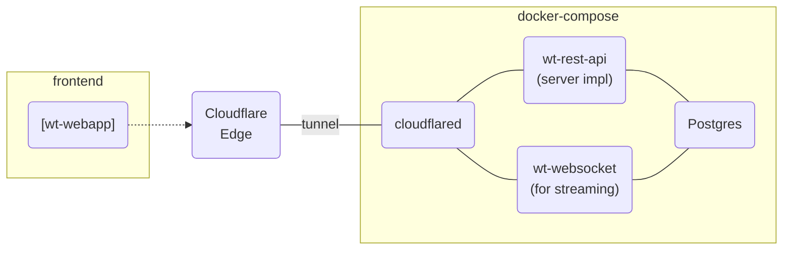

# Walkie Talkie

(todo: brief introductions)

## OpenAPI

OpenAPI specifications under [./openapi](./openapi/)
work as the *Single Source of Truth*:

- Design and write [OpenAPI Specifications](https://www.openapis.org/) (OAS) files.
- Generate server stubs (see [./wt-rest-stubs](./wt-rest-stubs)) by [openapi-generator-cli](https://github.com/OpenAPITools/openapi-generator).
- Generate client sdk (see [./wt-webapp-sdk](./wt-webapp-sdk)) by [openapi-generator-cli](https://github.com/OpenAPITools/openapi-generator).
- Lint OAS files by [redocly](https://github.com/Redocly/redocly-cli)
  and generated HTML which is deploy on [GitHub Pages](https://whisperpine.github.io/walkie-talkie/).
- Run contract tests by [Arazzo](https://www.openapis.org/arazzo-specification),
  generated by [redocly](https://github.com/Redocly/redocly-cli)
  according to OAS.


## Infrastructure as Code

These services are managed by Terraform / OpenTofu in this repo
(see [./infra/README.md](./infra/README.md)):

- [Cloudflare Pages](https://developers.cloudflare.com/pages/):
  just like GitHub Pages but with lower latency (the benefits of edge computing).
- [Cloudflare Tunnel](https://developers.cloudflare.com/cloudflare-one/connections/connect-networks/):
  provides a secure way to host services without a public IP address.

## Deployment

### Simplified Deployment

This approach is for test purpose (see [./prod.compose.yaml](./prod.compose.yaml)).



### High availability Deployment

This approach should be used in production (for reliability and scalability).


## Dev Environment

Dev environment is managed by Nix Flakes.
If you're not using nix, it's required to manually install tools listed in the
`packages` section of [flake.nix](./flake.nix).
Otherwise you can just run the following command to enter dev environment:

```sh
# `nix develop` needs to be run every time you `cd` in.
cd THIS_REPO && nix develop
```

[nix-direnv](https://github.com/nix-community/nix-direnv)
is highly recommended.
It automatically runs `nix develop` every
time you `cd` to the project.

```sh
# `dirnev allow` needs to be run only once.
# After that, when you `cd` in, nix dev env will be automatically loaded.
cd THIS_REPO && dirnev allow
```

## Dev Exeprience

Run `just -l` to see commonly used commands in this repo:

```txt
Available recipes:
    arazzo    # run OpenAPI contract tests by Arazzo
    build-api # build the docker image for wt-rest-api
    build-wt  # build the docker image for wt-websocket
    doc       # generate API documentation as an HTML file
    front     # run frontend wt-webapp in debug mode
    gen-axum  # generate server stubs with rust-axum generator
    gen-ts    # generate typescript client sdk
    lint      # lint OpenAPI Specifications
    preview   # build frontend wt-webapp and preview
    rest-api  # run backend wt-rest-api in debug mode
    spindown  # spin down the services, make it publicly unavailable
    spinup    # spin up the services, make it publicly available
    websocket # run backend wt-websocket in debug mode
```
